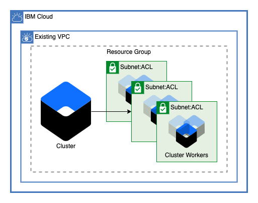
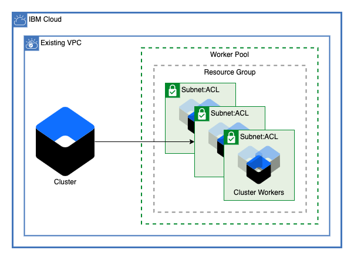
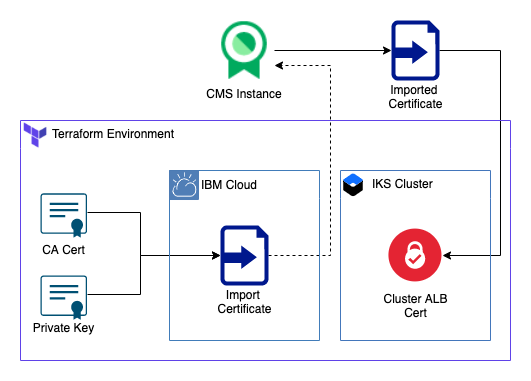

# VPC Cluster

This module deploys an IBM Cloud Kubernetes Cluster to an existing VPC.

IBM Cloud Kubernetes Service is a managed offering to create your own Kubernetes cluster of compute hosts to deploy and manage containerized apps on IBM Cloud. As a certified Kubernetes provider, IBM Cloud Kubernetes Service provides intelligent scheduling, self-healing, horizontal scaling, service discovery and load balancing, automated rollouts and rollbacks, and secret and configuration management for your apps. Combined with an intuitive user experience, built-in security and isolation, and advanced tools to secure, manage, and monitor your cluster workloads, you can rapidly deliver highly available and secure containerized apps in the public cloud.[1](https://cloud.ibm.com/docs/containers?topic=containers-overview)

## Optional Additions

This module allows the ability to optionally enable the use of Application Load Balancers, or ALB an external load balancer that listens for incoming HTTP, HTTPS, or TCP service requests. The ALB then forwards requests to the appropriate app pod according to the rules defined in the Ingress resource.[2](https://cloud.ibm.com/docs/containers?topic=containers-ingress-about) as well as additional worker pools in other resource groups.

### ALB Certificate

A ceritificate can be added in order to secure communications with the Application Load Balancer

### Worker Pools

Any number of worker pools can be added to the cluster accross subnets

---

### Table of Contents

[VPC Cluster](#vpc-cluster)

1.  [Optional Additions](#optional-additions)
    1. [ALB Certificate](#alb-certificate)
    2. [Worker Pools](#worker-pools)
    3. [Table of Contents](#table-of-contents)
2.  [Cluster](#cluster)
3.  [Application Load Balancers](#application-load-balancers)
4.  [Worker Pools](#worker-pools-1)
5.  [ALB Cert](#alb-cert)
6.  [Module Variables](#module-variables)
7.  [Outputs](#outputs)

---

## Cluster

This module allows for a cluster to be created accross any number of subnets in any number of zones within a single VPC. Optionally, public service endpoints on the cluster can be disabled to ensure that the public internet is not able to access the Kubernetes resources. For Gen2 VPC make sure your subnets have 256 available IPs to ensure the cluster can be created correctly.

## Application Load Balancers

After the cluster is created application both public and private Application Load Balancers can be enabled for the cluster.

## Worker Pools

This module allows the creation of any number of worker pools accross subnets. Worker pools can also be created in resource groups other than the one where the cluster is provisioned to limit access. Each worker pool can have a variable number of workers per zone.

## ALB Cert

If ALBs are enabled for the cluster, this optionally adds a certificate to the load balancers in order to facilitate authentication with custer applications. This module can create a new CMS instance or you can bring your own

---

## Module Variables

| Variable                          | Type                                                                                                                                                            | Description                                                                                                                                                                                                                                                                                                                                                                                                                                                                         | Default         |
| --------------------------------- | --------------------------------------------------------------------------------------------------------------------------------------------------------------- | ----------------------------------------------------------------------------------------------------------------------------------------------------------------------------------------------------------------------------------------------------------------------------------------------------------------------------------------------------------------------------------------------------------------------------------------------------------------------------------- | --------------- |
| `ibmcloud_api_key`                | string                                                                                                                                                          | The IBM Cloud platform API key needed to deploy IAM enabled resources                                                                                                                                                                                                                                                                                                                                                                                                               |
| `generation`                      | number                                                                                                                                                          | Generation of VPC. Can be 1 or 2                                                                                                                                                                                                                                                                                                                                                                                                                                                    | `1`             |
| `ibm_region`                      | string                                                                                                                                                          | IBM Cloud region where all resources will be deployed                                                                                                                                                                                                                                                                                                                                                                                                                               |
| `resource_group`                  | string                                                                                                                                                          | Name for IBM Cloud Resource Group where resources will be deployed                                                                                                                                                                                                                                                                                                                                                                                                                  |
| `vpc_name`                        | string                                                                                                                                                          | Name of VPC where cluster is to be created                                                                                                                                                                                                                                                                                                                                                                                                                                          |
| `subnets`                         | list of objects <ul><li>zone = string</li><li>subnet = number</li></ul>                                                                                      | List of maps containing data for the subnet id. The subnets must contain: `id` the id of the subnet and `zone` the zone number of the subnet (1,2,3). Any number of different subnets can be added                                                                                                                                                                                                                                                                                  |
| `cluster_name`                    | string                                                                                                                                                          | Name of cluster to be provisioned                                                                                                                                                                                                                                                                                                                                                                                                                                                   | `demo-cluster`  |
| `machine_type`                    | string                                                                                                                                                          | The flavor of VPC worker node to use for your cluster                                                                                                                                                                                                                                                                                                                                                                                                                               | `c2.2x4`        |
| `workers_per_zone`                | number                                                                                                                                                          | Number of workers to provision in each subnet                                                                                                                                                                                                                                                                                                                                                                                                                                       | `2`             |
| `disable_public_service_endpoint` | bool                                                                                                                                                            | Disable public service endpoint for cluster                                                                                                                                                                                                                                                                                                                                                                                                                                         | `false`         |
| `kube_version`                    | string                                                                                                                                                          | Specify the Kubernetes version, including the major.minor version. To see available versions, run ibmcloud ks versions. To use the default, leave string empty                                                                                                                                                                                                                                                                                                                      | ``              |
| `wait_till`                       | string                                                                                                                                                          | To avoid long wait times when you run your Terraform code, you can specify the stage when you want Terraform to mark the cluster resource creation as completed. Depending on what stage you choose, the cluster creation might not be fully completed and continues to run in the background. However, your Terraform code can continue to run without waiting for the cluster to be fully created. Supported args are `MasterNodeReady`, `OneWorkerNodeReady`, and `IngressReady` | `IngressReady`  |
| `tags`                            | list(string)                                                                                                                                                    | A list of tags to add to the cluster                                                                                                                                                                                                                                                                                                                                                                                                                                                | `[]`            |
| `pool_list`                       | list of objects <ul><li>pool_name = string</li><li>machine_type = string</li><li>workers_per_zone = number</li><li>(Optional) resource_group = string</li></ul> | List of maps describing worker pools                                                                                                                                                                                                                                                                                                                                                                                                                                                | `[]`            |
| `enable_public_albs`              | bool                                                                                                                                                            | Enable public albs                                                                                                                                                                                                                                                                                                                                                                                                                                                                  | `true`          |
| `enable_private_albs`             | bool                                                                                                                                                            | Enable private albs                                                                                                                                                                                                                                                                                                                                                                                                                                                                 | `true`          |
| `enable_alb_cert`                 | bool                                                                                                                                                            | Enable ALB cert. Use only if albs are enabled                                                                                                                                                                                                                                                                                                                                                                                                                                       | `true`          |
| `bring_your_own_cms`              | bool                                                                                                                                                            | Bring your own certificate managemant instance. If false, one will be created                                                                                                                                                                                                                                                                                                                                                                                                       | `false`         |
| `cms_name`                        | string                                                                                                                                                          | Name of certificate management instance                                                                                                                                                                                                                                                                                                                                                                                                                                             | `alb-cert-demo` |
| `cms_plan`                        | String                                                                                                                                                          | Name of the plan for CMS. Use only if `bring_your_own_cms` is false                                                                                                                                                                                                                                                                                                                                                                                                                 | `free`          |
| `certificate_name`                | string                                                                                                                                                          | Name of the ALB certificate to import                                                                                                                                                                                                                                                                                                                                                                                                                                               | `demo-alb-cert` |

---

## Outputs

| Name         | Value                                                              |
| ------------ | ------------------------------------------------------------------ |
| `cluster_id` | The ID of the cluster created                                      |
| `cms_id`     | (Optional) The ID of the cms instance used if creating an ALB Cert |
